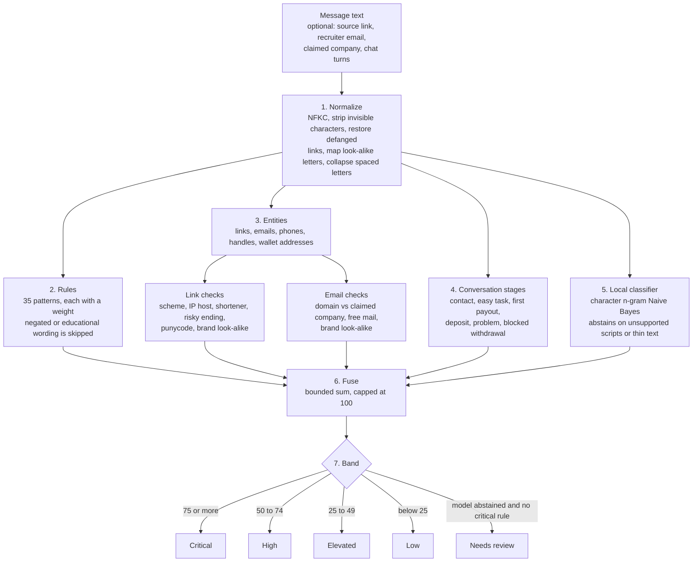
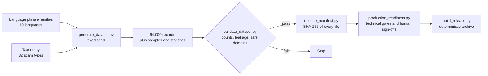

# NexVision ScamIntel

[](https://github.com/NexvisionLab/Automated-Investment-and-Recruitment-Fraud-Detection-Engine/actions/workflows/ci.yml)

**Job & Investment Scam Checker · research release**

NexVision ScamIntel is a local, explainable triage application and multilingual research dataset for job, paid-task, reshipping, money-mule and investment scams. The checker runs locally and uses no paid/professional reputation API, cloud AI API, API key or analytics service. Optional direct DNS/TLS and guarded webpage checks are disabled by default.

> **Research status:** this project is not a clearance service and is not yet approved for production decisions. A low score does not prove legitimacy. The bundled classifier is an experimental model trained on a small development seed, not an independently validated fraud probability model. See [production readiness](quality/PRODUCTION_READINESS_REPORT.md).

## Run the checker

Requires Python 3.10 or later.

```bash
python -m pip install -r app/requirements.txt
python app/server.py
```

Open `http://127.0.0.1:8787`. The server is deliberately restricted to loopback addresses. Core analysis, report generation, HTML parsing and optional screenshot OCR are local. OCR additionally requires a local Tesseract installation.

The checker provides:

- explainable rules and multi-message escalation analysis;
- Unicode/obfuscation normalization and negation handling;
- local English, Singlish, Chinese, Malay/Indonesian and Tamil character-model signals;
- registrable-domain, homograph, brand and recruiter-email checks;
- safe static HTML inspection and optional guarded retrieval;
- JSON, color-coded HTML and PDF reports that preserve the submitted message and source link;
- abstention for sparse or unsupported input.

The application code, UI, methodology and 270-case regression suite are in [`app/`](app/README.md).

## How the checker decides

The checker never returns a bare verdict. Every score is the sum of named components, and each component points back to the evidence that produced it.



### The steps

1. **Normalize.** Scammers hide wording so pattern matching misses it. The checker undoes the common tricks before anything else: Unicode compatibility forms, zero-width and control characters, `hxxps://` and `[.]` link notation, look-alike letters (Cyrillic or Greek characters standing in for Latin ones), letters separated by spaces, and common leetspeak. The original text is kept and shown in the report; only the matching copy is changed.
2. **Rules.** [`app/rules.py`](app/rules.py) holds 35 rules, 21 of them critical. Each one is a regular expression with a category, a weight, a plain-language explanation and a recommended action. Examples: a fee required before work starts, a deposit tied to tasks, a "negative balance" that must be topped up, a personal account used to receive funds, guaranteed returns, a payment demanded to release a withdrawal. Five rules are multilingual anchors for Singlish, Chinese, Malay/Indonesian and Tamil. A rule is skipped when the wording around the match negates it, for example "returns are not guaranteed" or "never pay a fee to a recruiter".
3. **Entities and links.** Links, emails, phone numbers, handles and wallet addresses (Bitcoin, Ethereum, TRON) are extracted. Each link is scored on missing HTTPS, credentials in the address, an IP address instead of a name, a URL shortener, a higher-abuse ending such as `.top` or `.xyz`, punycode, many hostname levels, and a domain that resembles a known brand without being one of its official domains. Each email is compared with the company the sender claims to represent.
4. **Conversation stages.** For a multi-message chat, the checker looks for the order that paid-task and investment scams follow: unsolicited contact, an easy task, a small first payout that builds trust, a deposit, a problem that needs more money, and finally a blocked withdrawal. Each stage found adds points, and stages appearing in that order add more.
5. **Local classifier.** A character n-gram Naive Bayes model gives a second opinion. It **abstains** when the writing is mostly outside the scripts it knows (Latin, Chinese, Tamil), when the text is too short, or when its score is uncertain and the evidence is thin. An abstention contributes nothing to the score.
6. **Fuse.** The components are added with a cap on each, so no single signal can decide the result alone, and the total is capped at 100.
7. **Band.** The total maps to a band. If the classifier abstained and no critical rule fired, the answer is "Needs review" rather than "Low", so unsupported input is never reported as safe.

### How the score is built

| Component | Contribution | Cap |
|---|---|---:|
| Rules | `72 × (1 − e^(−points / 70))`, where points is the sum of the matched rule weights | 68 |
| Links | sum of link risk points | 28 |
| Identity | sum of email and sender risk points | 25 |
| Conversation | 4 per stage found, plus 2 for each pair of stages in order | 30 |
| Classifier | calibrated score × 28, or 0 if it abstained | 28 |
| Suspicious Unicode | flat 7 when look-alike or hidden characters were present | 7 |

The rule term flattens as points grow, so piling on more matches gives diminishing returns. If no rule matched and the classifier scores below 0.5, the total is held to 20 or less.

**Worked example.** The message *"Earn 500 USDT daily! Top up 300 USDT to unlock your tasks. Guaranteed 30% daily profit. Act now."* matches five rules: `job_upfront_fee` (38), `task_deposit` (40), `guaranteed_returns` (39), `unrealistic_return` (34) and `pressure` (13). That is 164 raw points, which the diminishing-returns formula turns into 65. The conversation stages add 10 and the classifier adds 28. The sum is 103, capped at **100, Critical**. A plain job advertisement that says "No payment is required" matches no rule, scores 0 and lands in **Low**.

### What this does not tell you

- A low score is not proof that an offer is real. The rules only recognise wording they were written for.
- The classifier is trained on a small built-in seed of 34 example sentences (16 legitimate, 18 scam). It is **not** trained on the 64,000-record dataset below. Its calibration is internal and is not a fraud probability.
- The rule weights and score caps are hand-set, not fitted to real-world data. Treat the bands as triage, not as measured accuracy.
- Live checks (DNS and certificate lookups) run only when you switch them on. Message content is never sent anywhere.

## How the dataset is built

The dataset and the checker are separate. The dataset is a deterministic generator with its own validation and release gates.



Running the generator twice with the same version and seed produces identical bytes. The validator rejects live domains, so generated links use only reserved `.invalid` and `.example` names. Human governance gates, such as native-speaker review, cannot be approved by the build itself, which is why the readiness report currently reads not ready for production.

## Research dataset

**Current dataset release:** 1.2.0

The accompanying deterministic, privacy-safe corpus supports development and evaluation of job-scam and investment-scam detection systems. It contains no live malicious links, real credentials, personal data or operational scam infrastructure.

This repository contains the generator, validation tools, taxonomy, curated samples and governance documentation. The 64,000-record canonical file is generated locally because its uncompressed size exceeds GitHub's ordinary source-file limit.

## Dataset composition

| Component | Records |
|---|---:|
| Scam examples | 32,000 |
| Legitimate hard negatives | 22,000 |
| Awareness and negated examples | 6,000 |
| Ambiguous/out-of-distribution abstention cases | 4,000 |
| **Total** | **64,000** |

The two top-level domains are balanced at 32,000 records each. The 32 scam leaf types contain exactly 1,000 scam records each. The corpus includes 52,000 single messages and 12,000 multi-turn conversations across 19 languages.

## Languages

English, Chinese, Malay, Tamil, Indonesian, Spanish, Portuguese, French, German, Hindi, Bengali, Urdu, Arabic, Japanese, Korean, Thai, Vietnamese, Filipino/Tagalog and Russian.

Non-English `text` is generated from auditable target-language phrase templates and no longer injects an English subtype sentence. `text_en` and `scenario_cue_en` provide an audit translation and leaf-level rationale. Every non-English record remains marked for native-speaker review and must not be represented as human-validated translation.

## What changed in 1.1

- Added 4,000 explicit `ambiguous_ood` cases for abstention testing.
- Removed accidental English leaf-cue injection from non-English training text.
- Added `text_en`, requested action, harm vector, severity, annotation confidence and label basis.
- Added six deterministic robustness variants, including defanged URLs, zero-width characters and punctuation/token obfuscation.
- Added `variant_family_id`; families and campaigns are isolated to one split.
- Added annotation guidance, a field dictionary, a native-review matrix and inter-annotator review templates.

### 1.1.1 audit hardening

- Removed two stale partial dataset files that accidentally entered the 1.1.0 archive.
- Expanded content hashes to cover English audit text and decision-critical annotation fields.
- Normalized obfuscated URL forms before enforcing reserved-domain safety.
- Made split materialization atomic and failure-cleaning.
- Added a deterministic, allowlisted release builder and release-hygiene tests.
- Added the standing NexVision development audit standard and an evidence-based audit report.

### 1.1.2 security hardening

- Replaced substring-based reserved-domain checking with parsed hostname validation.
- Added regression coverage for live domains containing `.invalid` in their path or hostname suffix.
- Prevented the release builder from following or packaging filesystem symlinks.

### 1.2.0 production controls

- Added a complete SHA-256 release manifest and archive verification.
- Added fail-closed technical and human-owned production-readiness gates.
- Added CI on Linux, Windows and macOS across Python 3.10 and 3.12, dependency update configuration and a security policy.
- Added regression tests for attestations, manifest tampering and release hygiene.

## Files

- `data/records.jsonl` — generated locally; contains all 64,000 records and is intentionally not committed.
- `metadata/split_index.csv` — generated locally with the corpus; deterministic split membership and leakage-control groups. It is included in the full release archive but omitted from the GitHub source tree because it is reproducible.
- `scripts/materialize_splits.py` — recreates `data/train.jsonl`, `validation.jsonl` and `test.jsonl` from the canonical file. The release archive omits these duplicate full-text files to avoid shipping every record twice.
- `taxonomy/taxonomy.json` — 32 leaf definitions, mechanisms, signals and lifecycle stages.
- `samples/taxonomy_sample_320.jsonl` and `.csv` — ten examples from each leaf type.
- `samples/curated_eval_512.jsonl` and index — test-only balanced evaluation slice with 256 scam, 128 legitimate, 64 awareness and 64 OOD cases.
- `metadata/external_sources_manifest.csv` — researched public and restricted sources. Their records are not redistributed.
- `metadata/dataset_stats.json` — class, language, domain and split distributions.
- `metadata/checksums.json` — SHA-256 evidence hashes for principal files.
- `quality/validation_report.json` and `QA_REPORT.md` — automated validation outcome.
- `quality/ANNOTATION_GUIDELINES.md` — label, severity and abstention rules.
- `quality/native_review_matrix.csv` and `inter_annotator_template.csv` — human-review workflow.
- `metadata/field_dictionary.csv` — machine-readable field documentation.
- `metadata/evaluation_slices.json` and `quality/language_audit.json` — evaluation composition and multilingual audit evidence.
- `scripts/generate_dataset.py` — deterministic offline generator.
- `scripts/validate_dataset.py` — safety, integrity, balance and leakage checks.
- `metadata/release_manifest.json` — SHA-256 inventory of every distributed file.
- `quality/PRODUCTION_READINESS_REPORT.md` — current technical and governance gate status.
- `SECURITY.md` — supported reporting and disclosure process.

## Generate and validate

Python 3.10 or later is sufficient; no third-party packages or network access are required.

```bash
python scripts/generate_dataset.py
python scripts/validate_dataset.py
python -m unittest discover -s tests -v
python scripts/release_manifest.py
python scripts/production_readiness.py
python scripts/build_release.py
python -m unittest discover -s app/tests -v
node --check app/static/app.js
```

The generator is deterministic. Running it twice with the same version and seed produces the same canonical dataset bytes.

## Documentation

- [Checker guide](app/README.md)
- [Checker methodology](app/METHODOLOGY.md)
- [Checker validation record](app/QA_REPORT.md)
- [Dataset card](DATASET_CARD.md)
- [Methodology](METHODOLOGY.md)
- [Taxonomy](taxonomy/TAXONOMY.md)
- [Architecture and data flow](docs/ARCHITECTURE.md)
- [Annotation guidelines](quality/ANNOTATION_GUIDELINES.md)
- [Public security audit](PUBLIC_SECURITY_AUDIT.md)
- [Production-readiness status](quality/PRODUCTION_READINESS_REPORT.md)
- [Security policy](SECURITY.md)
- [Contributing](CONTRIBUTING.md)

## Important use limitations

- This is a synthetic research corpus, not evidence of real incidents and not a population sample.
- It is suitable for regression testing, pipeline development, taxonomy experiments and pre-training—not standalone production validation.
- Measure performance on independent, real, campaign-separated data before operational deployment.
- Preserve campaign grouping when making new splits. Random message-level splitting can leak near-template variants across train and test sets.
- Keep synthetic, imported-real, translated and human-reviewed material in distinct provenance partitions.
- Treat `ambiguous_ood` as an abstain/review target, not as a fourth scam class unless the modelling design explicitly requires it.
- Never infer a sender's country from the contextual country field; it is scenario metadata, not geolocation.

## Licence

Copyright © 2026 NexVision Lab.

This project is source-available under the PolyForm Noncommercial License 1.0.0. It may be used, studied and modified for permitted non-commercial purposes.

Commercial use, paid services, commercial redistribution, production deployment and hosted services require a separate written licence from NexVision Lab.

SPDX-License-Identifier: PolyForm-Noncommercial-1.0.0

This is source-available software and data, not an OSI-approved open-source licence. Contact NexVision Lab through the repository's official channels for commercial licensing.
